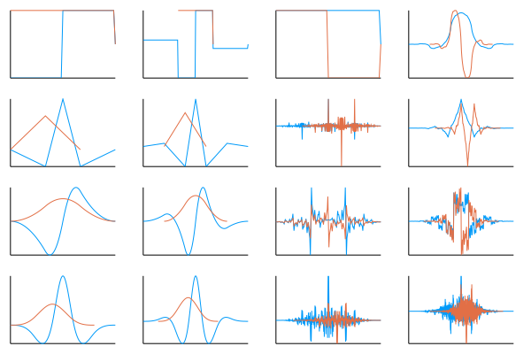
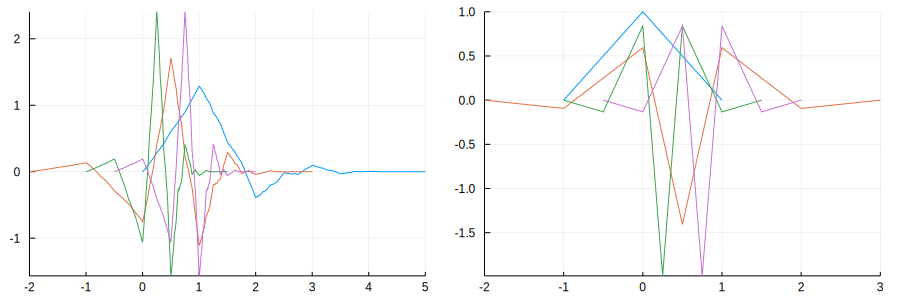
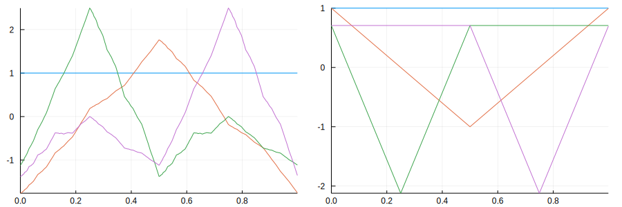
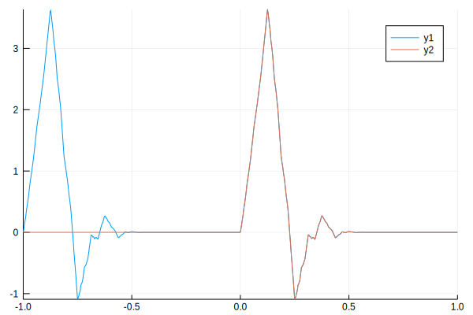
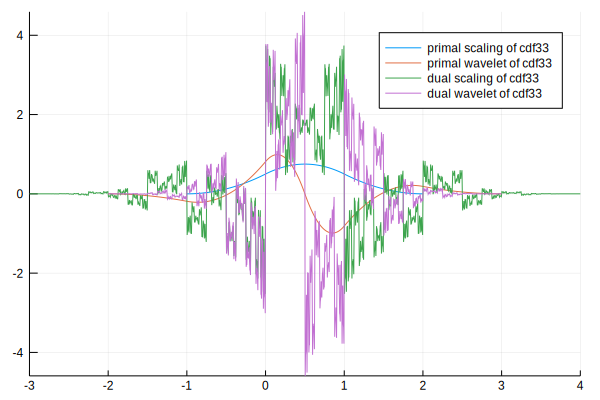
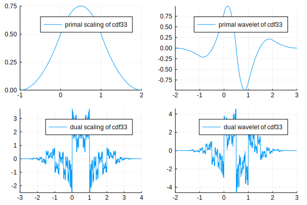
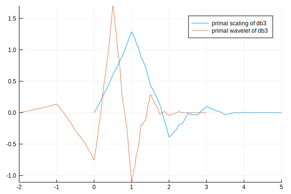
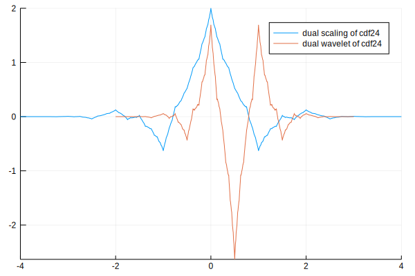
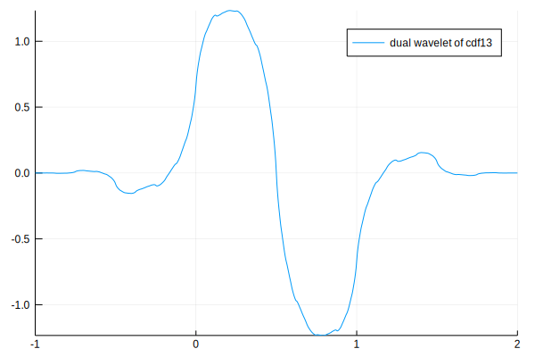

[](https://travis-ci.org/vincentcp/Wavelets.jl)
[](https://coveralls.io/github/vincentcp/Wavelets.jl?branch=master)
# Wavelets
A julia package for a fast Discrete Wavelet Transform, and plotting and evaluation of wavelets 


```julia
#Pkg.clone("https://github.com/vincentcp/WaveletsCopy.jl.git")
#Pkg.build("WaveletsCopy")
```


```julia
using WaveletsCopy 
using Plots
```

A list of all available wavelets is given by


```julia
print_implemented_wavelets()
```

    ("db1", "db2", "db3", "db4", "db5", "db6", "db7", "db8", "db9", "db10", "cdf11", "cdf13", "cdf15", "cdf24", "cdf26", "cdf31", "cdf33", "cdf35", "cdf42", "cdf44", "cdf46", "cdf51", "cdf53", "cdf55", "cdf62", "cdf64", "cdf66")


Some examples are


```julia
db4, cdf53
```


    (WaveletsCopy.DWT.DaubechiesWavelet{4,Float64}(), WaveletsCopy.DWT.CDFWavelet{5,3,Float64}())


## 1 The Discrete Wavelet Transform

The wavelet transform is performed using


```julia
a = rand(1<<8);
dwt(a, db3, perbound);
```

Only periodic boundaries boundaries and dyadic length are supported. 


```julia
perbound
```


    WaveletsCopy.DWT.PeriodicBoundary()


```julia
b = dwt(a,db3,perbound);
c = idwt(b,db3,perbound);
@assert a≈c
```

## 2 Evaluation of wavelets

Use

`function evaluate_periodic_in_dyadic_points{T}(side::DWT.Side, kind::DWT.Scl, w::DWT.DiscreteWavelet{T}, j=0, k=0, d=10)`

to evaluate the primal/dual wavelet function $\phi_{k,j}(x) = 2^{j/2}\phi(2^jx-k)$ of type `w` in equispaced grid with a separation of $2^{-d}$

Here an example plotting the scaling (red) and wavelet (blue) functions of the CDF wavelets cdf11, cdf13, ..., cdf44.
In the left columns the primal functions and in the righ columns the dual functions.


```julia
plot(layout=(4,4),legend=false,ticks=nothing, border=nothing)
i=1;j=0;k=0;d=6
for p in 1:4
  qs = 2:2:4
  isodd(p) && (qs = 1:2:4 )
  for q in qs
    f, x = evaluate_in_dyadic_points(Primal, wavelet, CDFWavelet{p,q,Float64}(), j, k, d; points=true)
    plot!(x, -f, subplot=i)
    f, x = evaluate_in_dyadic_points(Primal, scaling, CDFWavelet{p,q,Float64}(), j, k, d; points=true)
    plot!(x, f, subplot=i)
    i += 1
  end
  for q in qs
    f, x = evaluate_in_dyadic_points(Dual, scaling, CDFWavelet{p,q,Float64}(), j, k, d; points=true)
    plot!(x, f, subplot=i)
    f, x = evaluate_in_dyadic_points(Dual, wavelet, CDFWavelet{p,q,Float64}(), j, k, d; points=true)
    plot!(x, f, subplot=i)  
    i += 1
  end
end
plot!()
```

    WARNING: Recursion algorithm is not convergent
    WARNING: Recursion algorithm is not convergent





Different translations and scales


```julia
plot(legend=false, layout=2,size=(900,300))
for wavelet_index in wavelet_indices(2)
    wavelet, j, k = wavelet_index
    f, x = evaluate_in_dyadic_points(Primal, wavelet, db3, j, k; points=true)
    plot!(x,f)
    f, x = evaluate_in_dyadic_points(Primal, wavelet, cdf24, j, k; points=true)
    plot!(x,f,subplot=2)
end
plot!()
```





Use

`function evaluate_periodic_in_dyadic_points{T}(side::DWT.Side, kind::DWT.Scl, w::DWT.DiscreteWavelet{T}, j=0, k=0, d=10)`

for wavelets periodized to the interval [0,1].


```julia
plot(legend=false, layout=2,size=(900,300))
for wavelet_index in wavelet_indices(2)
    wavelet, j, k = wavelet_index
    f, x = evaluate_periodic_in_dyadic_points(Primal, wavelet, db3, j, k; points=true)
    plot!(x,f)
    f, x = evaluate_periodic_in_dyadic_points(Primal, wavelet, cdf24, j, k; points=true)
    plot!(x,f,subplot=2)
end
plot!()
```





Also pointwise evaluation of scaling functions is possible up to some given precision. (There are still errors in the code depending on the point evaluation)
`evaluate{T, S<:Real}(side::Side, kind::Scl, w::DiscreteWavelet{T}, j::Int, k::Int, x::S; xtol::S=1e-5)`

`evaluate_periodic{T, S<:Real}(side::Side, kind::Kind, w::DiscreteWavelet{T}, j::Int, k::Int, x::S; xtol::S=1e-5)`


```julia
evaluate(Primal, scaling, db3, 0, 0, .123, xtol=1e-1), evaluate(Primal, scaling, db3, 0, 0, .123, xtol=1e-4)
```


    (0.13394983521281625, 0.13129163397063862)


```julia
t = linspace(-1,1,1000)
plot(t,evaluate_periodic.(Primal, scaling, db3, 3, 0, t))
plot!(t,evaluate.(Primal, scaling, db3, 3, 0, t))
```





## 3. Plotting of Wavelets

Plot all in one figure


```julia
plot(cdf33)
```





Or over different figures


```julia
plot(cdf33,layout=(2,2))
```





Of orthogonal wavelets only primal functions are shown since the duals are equal to the primal functions


```julia
plot(db3)
```





Plot only the dual (or primal) ones


```julia
plot(Dual,cdf24)
```





```julia
plot(Dual, wavelet,cdf13)
```





